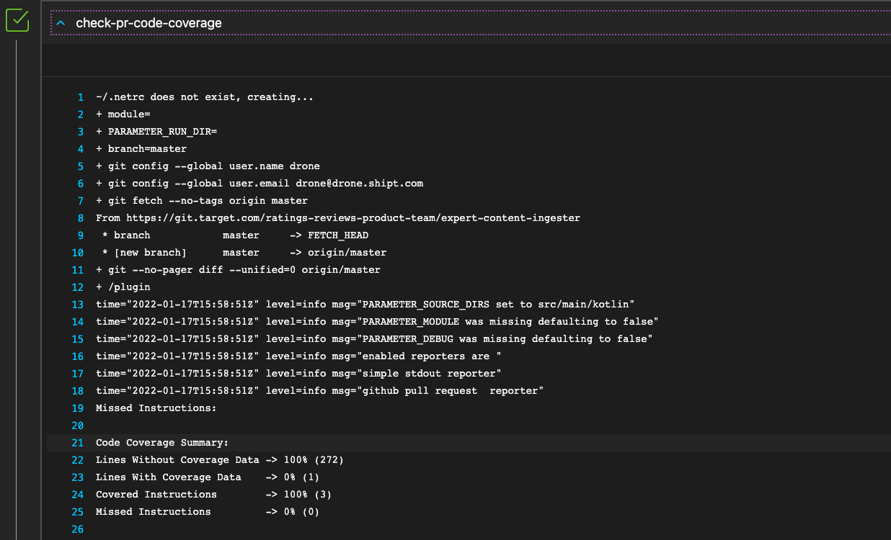
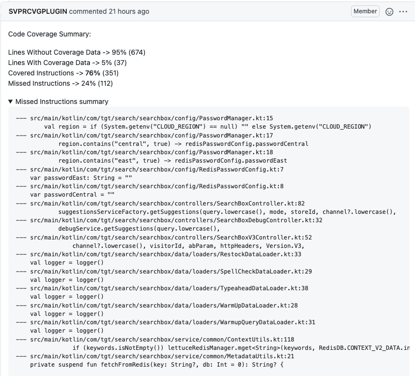

# pull-request-code-coverage


A continuous integration plugin to allow detecting code coverage for only the lines changed in a PR.

Sometimes when working to get a repo to an acceptable level of code coverage, it can be hard to tell if one change is
covered enough.  This plugin will look at just the lines changed in the PR and report code coverage for only those
lines.

This plugin will output the coverage details to the CI/CD step's console. A  sample [Vela](https://github.com/go-vela) step console 




This plugin  as well as has the ability to comment on the PR with a summary of the coverage details.


The PR comment is rendered as markdown and looks like this:

> ## 📊 Pull Request Code Coverage
>
> Coverage below is for **only the lines changed in this PR**.
>
> **Modules:** `category-search`
>
> | Metric | Coverage | Count |
> |:---|---:|---:|
> | ✅ Covered instructions | **73%** | 8 |
> | ❌ Missed instructions | 27% | 3 |
> | 📈 Lines with coverage data | 22% | 2 |
> | 📉 Lines without coverage data | 78% | 7 |
>
> <details><summary>ℹ️ What do these metrics mean?</summary>
>
> - **Covered instructions** — instructions (statements / bytecode) on the changed lines that were executed by your tests.
> - **Missed instructions** — instructions on the changed lines that were **not** executed by any test.
> - **Lines with coverage data** — changed lines the coverage tool tracks as executable code.
> - **Lines without coverage data** — changed lines with no coverage information (comments, blank lines, declarations, etc.).
> </details>
>
> <details><summary>❌ Lines missing coverage (1)</summary>
>
> **`category-search/src/main/java/com/tgt/CategorySearchApplication.java:52`**
> ```java
>     System.out.print("Something");
> ```
> </details>


Currently, this plugin supports two coverage file format.
* jacoco for jvm based languages like java,kotlin,scala
* cobertura can be used for golang projects using [gocov-xml](https://github.com/AlekSi/gocov-xml) utility

This plugin works out of box  for [Vela](https://github.com/go-vela),a CI/CD open-sourced by target

## VELA Usage

### Jvm based projects
For java/koltin based projects you need jacoco files that goes as an input to this plugin. How to generate jacoco files is outside the scope of
this project. Once you have that jacoco file, you can pass that path to coverage_file parameter as shown  below

```yaml
- name: check-pr-code-coverage
   image: docker.target.com/app/pull-request-code-coverage
   pull: true
   ruleset:
     event: [pull_request]
   parameters:
     coverage_type: jacoco
     coverage_file: some-sub-module/build/reports/jacoco/test/jacocoTestReport.xml
     source_dirs:
       - src/main/java
       - src/main/kotlin
     gh_api_base_url: https://git.target.com
     module: some-sub-module
   secrets:
     - source: pull_request_api_key
       target: plugin_gh_api_key
```


### Golang based projects
You can use [gocov-xml](https://github.com/AlekSi/gocov-xml) utility to generate coverage.xml
```
 - go get github.com/axw/gocov/gocov
 - go get github.com/AlekSi/gocov-xml
 - go test -v -coverpkg=./... -coverprofile=coverage.txt ./...
 - go tool cover -func=coverage.txt
 - gocov convert coverage.txt | gocov-xml > ./coverage.xml
```

Once you have coverage.xml same can  be passed as an input to plugin shown below

```yaml
- name: check-pr-code-coverage
   image: docker.target.com/app/pull-request-code-coverage
   pull: true
   ruleset:
     event: [pull_request]
   parameters:
     coverage_type: cobertura
     #coverage.xml generated in above step
     coverage_file: coverage.xml
     source_dirs:
       - /vela/src/github.com/targetOSS/pull-request-code-coverage
     gh_api_base_url: https://git.target.com
   secrets:
     - source: pull_request_api_key
       target: plugin_gh_api_key
```

#### Parameters

|param|required| default | description|
|---|---|---|---|
|coverage_type| true | | **supported values**: jacoco, cobertura<br><br>sets the coverage file format  |
|coverage_file| true | | path to where the coverage file will be located, relative to the working dir |
|source_dirs| true | | array of source dirs, relative to the working dir |
|gh_api_base_url| false | https://api.github.com | base url of the gh api for posting coverage comments<br><br>defaults to public GitHub; for GitHub Enterprise set this to your host (e.g. `https://git.target.com`)   |
|gh_api_key| false | | api key to auth for posting coverage comments<br><br>if not set, coverage details will not be commented on PR  |
|module | false  | \<empty string\> | sub-module to use if operating inside a multi-module project (e.g. gradle multi-project build) |

# Development

This project needs  go (>= 1.17) to be  installed. Make sure you run
* make format
* make lint 

 before submitting a PR

# License
This project is licensed under the Apache License, Version 2.0.